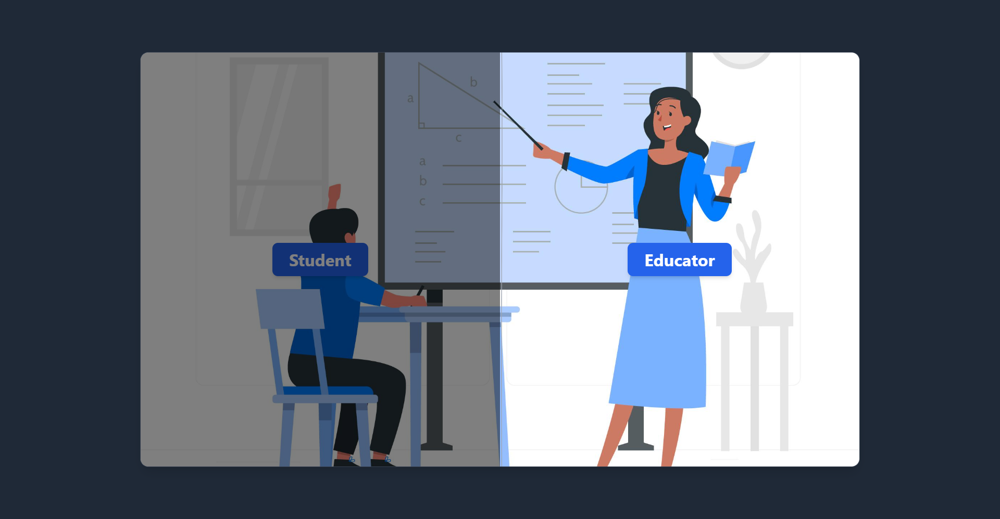
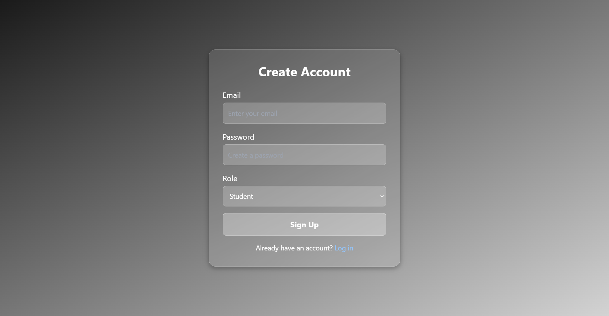
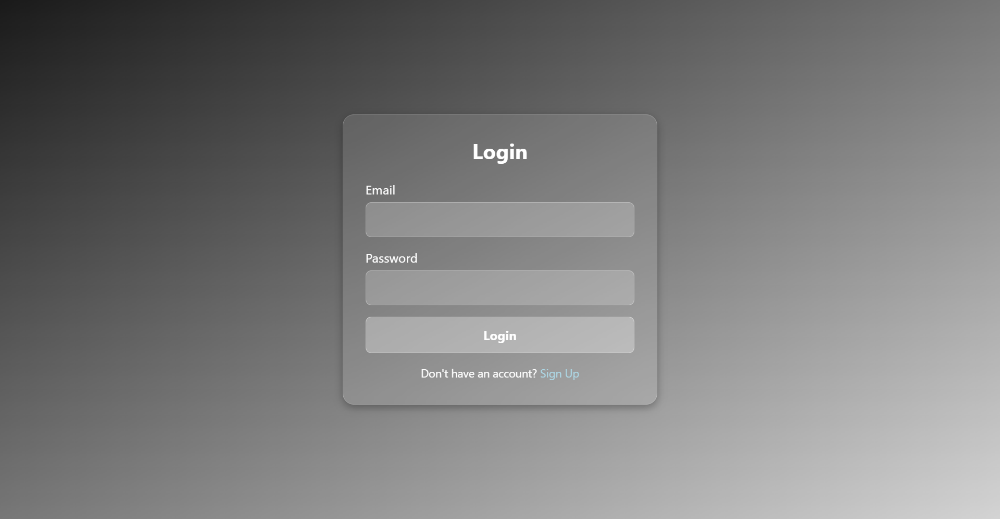
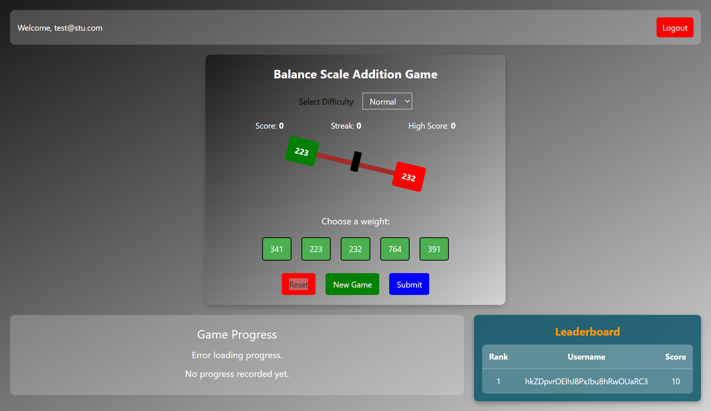
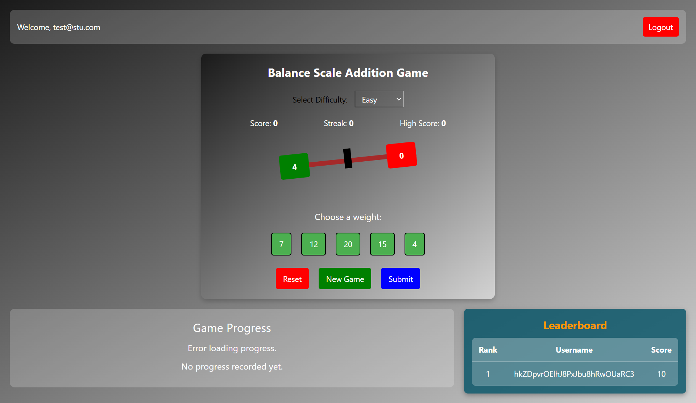

# Balance Scale Addition Game  

This project is an interactive educational game designed to help students understand addition using a balance scale. The backend is built with FastAPI and Firebase, and the frontend is developed using Vue.js.  

## ✅ Implemented Features  
- **Authentication System** – Firebase-based Signup/Login with role management (Player/Admin).  
- **Balance Scale Mechanics** – Interactive tilting effect, user input, and real-time visual updates.  
- **Scoring System** – Points awarded based on difficulty level, with streak-based bonuses.  
- **Teacher Dashboard** – Interface for managing game configurations.  
- **Game State Management** – High score tracking and reset logic upon incorrect answers.  

## ⚠️ Remaining Tasks  
- **Custom Game Creation Rework** – Currently, teachers can create custom games, and students can fetch them using difficulty levels. However, this system needs improvement, and I plan to refine it.  
- **More Responsive UI Adjustments** – Optimize for mobile & different screen sizes.  
- **Game Session Storage in Firestore** – Proper progress tracking for users.  
- **Admin Panel for Educators** – Managing student progress & activity logs.  
- **Error Handling & Unit Testing** – Robust API & frontend validation.  
- **Dockerization for Backend** (Optional but improves portability).  
- **Landing Page Logic** – Currently, the landing page just leads to a login page. The goal is to direct users to different pages based on their selection (Teacher or Student).  
- **Leaderboard System** – Displays scores based on UID. Since usernames weren’t collected at login, this feature needs adjustments.  
- **Game Submission to Firestore** – Currently under development. I plan to complete this soon to allow saving and tracking user progress properly.  

## 🛠️ Tech Stack  
- **Backend:** FastAPI  
- **Frontend:** Vue.js  
- **Database:** Firestore  
- **Authentication:** Firebase Authentication  

## Screenshots  

  
  
  
  
  
